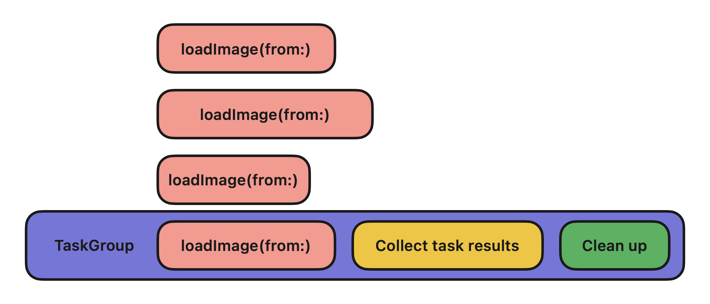

# Photos

> Unsplash API를 사용하여 사진 목록을 표시하는 iOS 앱


## 인덱스

- [MVVM 아키텍처](#mvvm-아키텍처)
- [GCD 및 Swift Concurrency 비교](#gcd-및-swift-concurrency-비교)
  - [네트워킹](#네트워킹)
  - [동시성](#동시성)
  - [가독성](#가독성)
  - [Main Queue](#main-queue)

## MVVM 아키텍처

MVVM은 모델(model), 뷰(view), 뷰 모델(view model)로 구성되는 아키텍처 패턴이다. MVVM에서는 뷰 모델을 사용함으로써 뷰가 모델에 의존하지 않고 UI에만 초점을 맞추도록 한다. 뷰와 뷰 모델은 바인딩을 통해 상호 작용하는데, 뷰의 인풋으로부터 뷰 모델이 모델을 업데이트하고 모델의 아웃풋에 따라 뷰가 업데이트된다. 비즈니스 로직을 뷰 모델에서 구현하므로, 뷰 컨트롤러가 간단해지고 UI 구현 없이 테스트할 수 있다는 이점이 있다.

뷰와 뷰 모델의 바인딩을 위해 [Observable](https://github.com/meregrey/photos/blob/main/Photos/Photos/Common/Observable.swift)로 모델을 래핑해 사용한다. `Observable`은 제네릭 타입의 값을 포함하며, 값이 변경되면 지정된 핸들러를 호출해 값이 변경되었음을 알린다. 이러한 `Observable`을 뷰 모델이 포함하고 해당 뷰 모델을 뷰가 포함해, 모델 변경 시 자동으로 UI를 업데이트할 수 있다.

```swift
final class PhotoListViewController: UIViewController {
    private let viewModel = PhotoListViewModel()
    
    private func bindViewModel() {
        viewModel.photoList.bind { [weak self] photoList in
            // ...
        }
    }
}

final class PhotoListViewModel {
    let photoList: Observable<(photos: [Photo], latestRange: Range<Int>)> = Observable(([], 0..<0))
}
```

사진 목록을 표시하는 과정은 다음과 같다.

1. 앱 최초 실행 시 뷰가 뷰 모델에 사진 가져오기를 요청한다. 이후에는 스크롤링을 통해 사진 목록의 하단에 도달하면 즉, 마지막 행의 이전 행이 표시되기 직전에 사진 가져오기를 요청한다.
1. 뷰 모델은 필요한 [Endpoint](https://github.com/meregrey/photos/blob/main/Photos/Photos/Networking/Endpoint.swift)를 생성하고 [DataLoader](https://github.com/meregrey/photos/blob/main/Photos/Photos/Networking/DataLoader.swift)를 사용해 데이터 로드를 실행한다.
   - 결과가 성공인 경우, [ImageLoader](https://github.com/meregrey/photos/blob/main/Photos/Photos/Networking/ImageLoader.swift)를 사용해 각 URL에 해당하는 이미지를 로드하고 로드 완료 시 모델을 업데이트한다. 이때 새로 추가된 범위를 나타내는 `Range<Int>` 타입의 `latestRange`도 함께 업데이트한다.
   - 결과가 실패인 경우, 에러 발생을 알린다.
1. 사진 가져오기 결과에 따라 화면을 표시한다.
   - 결과가 성공인 경우, 바인딩에 의해 자동으로 새로운 사진이 추가된다. 테이블 뷰 전체를 리로드하는 방식이 아닌 `latestRange`에 해당하는 범위에 대해서만 행이 추가된다.
   - 결과가 실패인 경우, 얼럿을 통해 에러 메시지가 표시된다.

## GCD 및 Swift Concurrency 비교

GCD(Grand Central Dispatch)는 기존의 iOS 개발에서 사용하는 동시성 프로그래밍 API이다. 디스패치 큐(dispatch queue)에 작업을 보내면 시스템이 스레드를 관리하고 실행하는 방식으로, 한 번에 하나씩 순차적으로 실행하는 직렬(serial) 큐 또는 동시적으로 실행하는 동시(concurrent) 큐로 나뉜다. 주로 비동기 작업을 수행하기 위해 사용하며, 완료 시점에 탈출 클로저를 호출해 처리한다.

Swift concurrency는 Swift 5.5에서 처음 소개된 기능으로, async/await 패턴의 비동기 함수 및 동시성을 지원한다. 핸들러를 사용하는 기존 방식은 비동기 작업이 중첩되거나 비동기 호출 간의 제어 흐름이 복잡해지면 가독성이 저하되는데, Swift concurrency의 경우 `await` 키워드로 인해 실행이 일시 중단되고 재개될 때까지 기다린 후 다음 코드가 실행되므로 이해하기 쉽게 작성할 수 있다.

### 네트워킹

서버로부터 데이터를 로드하기 위해 `URLSession`을 사용한다. 두 방식에서 사용하는 `URLSession`의 메서드가 다르며, 동작에 따라 `DataLoader` 메서드의 시그니처가 달라지게 된다.

#### GCD

`URLSession` 인스턴스의 `dataTask(with:completionHandler:)` 메서드를 사용한다. 해당 메서드는 비동기로 동작하고, 요청이 완료되면 `completionHandler`를 호출한다. 따라서 `fetch(with:completion:)` 메서드에서 `completion`을 전달 받는다.

```swift
func fetch<T: Decodable>(with endpoint: Endpoint, completion: @escaping (Result<T, LoadingError>) -> Void) {
    // ...
    let task = urlSession.dataTask(with: request) { data, response, error in
        // ...
        completion(.success(result))
    }
    // ...
}
```

#### Swift Concurrency

`URLSession` 인스턴스의 `data(for:delegate:)` 메서드를 사용한다. 해당 메서드는 `async` 키워드가 표시된 비동기 메서드로, `(Data, URLResponse)` 타입의 튜플을 반환한다. GCD의 경우와 달리 값을 반환하기 때문에, `fetch(with:)` 메서드에서 핸들러를 전달 받을 필요가 없다. 다만 내부에서 에러를 던질 수 있음을 알리는 `try` 키워드와 실행이 일시 중단될 수 있음을 알리는 `await` 키워드를 사용하므로, `fetch(with:)` 메서드에 `async throws` 키워드를 표시해야 한다.

```swift
func fetch<T: Decodable>(with endpoint: Endpoint) async throws -> T {
    // ...
    let (data, response) = try await urlSession.data(for: request, delegate: nil)
    // ...
}
```

### 동시성

`ImageLoader`는 `[URL]` 배열을 전달 받아 각 `URL`에 해당하는 이미지를 로드하고 캐싱한다. 여러 이미지를 로드하는 경우, 각 이미지가 로드되는 순서가 중요하지 않으므로 동시적으로 작업을 실행하는 것이 더 효율적이다. 또한 앱에서는 지정된 개수의 이미지가 모두 로드되면 목록에 추가하므로 완료 시점을 파악할 수 있도록 한다.

#### GCD

`DispatchQueue`의 `concurrentPerform(iterations:execute:)` 메서드는 단일 클로저를 디스패치 큐에 제출하고 지정된 횟수만큼 동시적으로 실행되도록 한다. 따라서 `[URL]` 배열을 반복하기에 적합하지만, 모든 작업이 완료되는 시점은 알 수가 없다. 이를 해결하기 위해 `DispatchGroup`을 사용해 작업의 실행 상태를 알리고 모든 작업이 완료되면 `completion`을 실행한다.

```swift
func loadImages(from urls: [URL], completion: @escaping () -> Void) {
    let dispatchGroup = DispatchGroup()

    DispatchQueue.concurrentPerform(iterations: urls.count) { index in
        let url = urls[index]
        // ...
        dispatchGroup.enter()
        loadImage(from: url) {
            dispatchGroup.leave()
        }
    }

    dispatchGroup.notify(queue: DispatchQueue.global()) {
        completion()
    }
}
```

#### Swift Concurrency

Swift의 `withTaskGroup(of:returning:body:)` 함수는 자식 task를 포함하고 실행하며, 모든 자식 task가 완료되거나 취소될 때까지 기다린 후 반환된다. 따라서 `await` 키워드를 사용해 `loadImages(from:)` 메서드를 호출하면 모든 자식 task가 완료된 후 실행이 재개되므로, GCD의 경우와 달리 완료 시점을 알기 위한 구현이 필요하지 않다.

```swift
func loadImages(from urls: [URL]) async {
    await withTaskGroup(of: Void.self) { group in
        for url in urls {
            // ...
            group.addTask {
                await self.loadImage(from: url)
            }
        }
    }
}
```

<p align="center"></p>

### 가독성

GCD와 Swift Concurrency의 문법이 다름에 따라 가독성에 차이가 있다. 아래의 예시는 [PhotoListViewModel](https://github.com/meregrey/photos/blob/main/Photos/Photos/PhotoList/PhotoListViewModel.swift)의 메서드로, API를 사용해 데이터를 가져온 후 이미지 로드를 수행한다.

#### GCD

비동기적으로 실행 시 즉시 반환되기 때문에, 핸들러를 전달해 작업이 완료되는 시점에 호출되도록 한다. 따라서 핸들러 작성과 그에 따른 들여쓰기로 인해 가독성이 저하될 수 있다.

```swift
func fetchPhotos(errorHandler: @escaping (LoadingError) -> Void) {
    // ...
    dataLoader.fetch(with: endpoint) { (result: Result<[Photo], LoadingError>) in
        switch result {
        case .success(let photos):
            let urls = photos.compactMap { $0.url }
            self.imageLoader.loadImages(from: urls) {
                // ...
            }
        case .failure(let error):
            errorHandler(error)
        }
    }
}
```

#### Swift Concurrency

`async` 함수 호출 시 실행이 일시 중단될 수 있고 작업이 완료되면 반환 후 실행이 재개된다. `await` 키워드를 표시한 라인 이후의 코드는 작업이 완료될 때까지 기다린 다음 실행되기 때문에, `async` 함수에 핸들러를 전달할 필요가 없어 상대적으로 가독성이 좋다.

```swift
func fetchPhotos() async throws {
    // ...
    let photos: [Photo] = try await dataLoader.fetch(with: endpoint)
    let urls = photos.compactMap { $0.url }
    await imageLoader.loadImages(from: urls)
    // ...
}
```

### Main Queue

백그라운드 스레드에서 네트워킹과 같은 작업을 마치면 결과를 화면에 표시한다. 이때 UI 업데이트는 반드시 메인 스레드에서 실행해야 하는데, 모든 변경 사항이 메인 런 루프(run loop)에 의해 동시에 적용되어야 하기 때문이다. 만약 백그라운드 스레드에서 실행한다면 각 스레드마다 자체 런 루프를 갖기 때문에 동시에 적용될 수 없다. iOS에서는 스레드를 직접 관리할 필요 없이 메인 디스패치 큐에 작업을 보내 메인 스레드에서 실행하도록 한다.

#### GCD

메인 스레드와 연결된 디스패치 큐를 나타내는 `DispatchQueue.main` 인스턴스의 `async(group:qos:flags:execute:)` 메서드를 호출해 큐에 작업을 보내고 비동기적으로 실행한다.

```swift
private func bindViewModel() {
    viewModel.photoList.bind { [weak self] photoList in
        DispatchQueue.main.async {
            let indexPaths = photoList.latestRange.map { IndexPath(row: $0, section: 0) }
            self?.tableView.insertRows(at: indexPaths, with: .automatic)
        }
    }
}
```

#### Swift Concurrency

`Task`는 비동기 작업의 단위를 의미하고, `Task.init(priority:operation:)` 이니셜라이저를 호출해 생성하면 즉시 실행된다. `operation`으로 전달한 클로저에서 `await MainActor.run`을 볼 수 있는데, 이는 메인 디스패치 큐를 사용하기 위한 코드이다. `MainActor`는 작업을 실행하기 위해 메인 디스패치 큐를 사용하는 싱글턴 액터로, `run(resultType:body:)` 메서드로 전달 받은 클로저를 실행한다. `await` 키워드가 표시된 이유는 `MainActor`에 먼저 처리해야 하는 다른 작업이 존재할 수 있으므로 `MainActor`가 허용할 때까지 실행이 일시 중단될 수 있기 때문이다.

```swift
private func bindViewModel() {
    viewModel.photoList.bind { [weak self] photoList in
        Task {
            await MainActor.run {
                let indexPaths = photoList.latestRange.map { IndexPath(row: $0, section: 0) }
                self?.tableView.insertRows(at: indexPaths, with: .automatic)
            }
        }
    }
}
```
